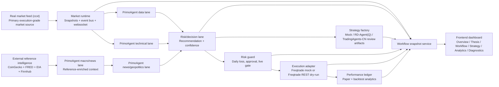

# SFC-Quant System Workflow & Evaluation Runbook

## Purpose

This runbook explains how the current `SFC-Quant` system actually works, which parts create real operator value, where to operate it in the UI, and how to evaluate whether the runtime is healthy and useful.

## End-to-End Workflow



## What Is Actually Core vs Optional

### Core execution chain

1. `ccxt` real market feed or truthful mock fallback
2. `PrimoAgent` four-lane analysis (`data`, `technical_analysis`, `news_geopolitics`, `risk_decision`)
3. risk guard
4. paper execution adapter
5. performance ledger
6. workflow snapshot + dashboard surfaces

If these six parts are healthy, the system already works as a coherent paper-trading decision platform.

### Optional but valuable extensions

- `CoinGecko`: crypto reference tape for cross-checking crypto beta and 24h move context
- `FRED`: macro rates / dollar context for the macro lane
- `EIA`: energy / inflation pressure proxy
- `Finnhub`: live crypto headline tape
- `RD-Agent(Q)` / `TradingAgents-CN`: review-artifact generation for strategy research, not required for the core paper workflow

## Why The Current Design Is Reasonable

### Good design choices

- `ccxt` remains the primary market source, so the execution-facing market path stays aligned with the mandated stack.
- External APIs are used as **reference intelligence**, not hidden replacements for the core market feed.
- `PrimoAgent` remains explainable because every lane still emits typed evidence and linked sources.
- Risk and paper execution stay explicit, so the UI never implies that reference data equals permission to trade live.
- The workflow page now functions as an operator command map instead of a decorative scene.

### Where value is strongest

- **Overview**: fastest truth surface for market source, execution mode, system status, and quick actions.
- **Latest Thesis**: most useful place to inspect whether the AI stack produced an actionable, explainable view.
- **Macro evidence + strategy workspace**: now significantly more valuable because the macro lane can reference live CoinGecko / FRED / EIA / Finnhub context.
- **Workflow Studio**: useful for debugging stage handoff, provider status, and whether the system is genuinely acting as one pipeline.
- **Analytics**: valuable after dispatches, because paper PnL / drawdown / trade log validate whether the system is doing anything useful beyond narrative generation.

### Where value is still partial

- `RD-Agent(Q)` and `TradingAgents-CN` are still secondary research seams, not the heartbeat of the platform.
- Public deployment is weaker than local deployment because the project is intentionally local-first and relies on a stateful backend + websocket runtime.
- The macro/reference layer improves context quality, but it does not magically turn the system into a live fully autonomous strategy engine.

## External API Assessment

These checks were validated live during this run on **2026-04-04**.

| API | Status | Value to SFC-Quant | Integration decision |
|---|---|---|---|
| Finnhub | reachable | High for live crypto headlines / macro-news context | Integrated into macro/news reference layer |
| FRED | reachable | High for rates / dollar / liquidity context | Integrated into macro reference layer |
| EIA | reachable | Medium for oil / inflation pressure context | Integrated into macro reference layer |
| CoinGecko | reachable | High for crypto reference tape and cross-asset crypto context | Integrated into macro reference layer |

## Where To Operate In The UI

### 1. `总览` / `Overview`
Use this first.

Look here for:
- requested vs effective market source
- current execution mode (`PAPER`)
- system status
- quick actions (`运行分析`, `派发模拟交易`, refresh, reconnect)

### 2. `最新论点` / `Latest Thesis`
Use this when you want the current AI recommendation.

Look here for:
- recommendation
- confidence
- role-by-role rationale
- whether the macro lane changed the final view

### 3. `工作流中枢` / `Workflow Studio`
Use this when you want to debug the pipeline itself.

Look here for:
- current active stage
- PrimoAgent role outputs
- strategy provider matrix
- execution adapter truth
- mission log / recent events
- system value audit / evaluation playbook

### 4. `宏观证据与策略工作区`
Use this when you want to judge whether the AI is grounded.

Look here for:
- thesis evidence
- **live macro reference panel** (CoinGecko / FRED / EIA / Finnhub)
- strategy provider runtime
- strategy artifacts

### 5. `分析与表现` / analytics area
Use this after paper dispatches or backtests.

Look here for:
- paper return
- drawdown
- trade list
- factor radar
- signal log

### 6. `诊断` / diagnostics area
Use this when something feels off.

Look here for:
- warnings
- reconnect state
- requested/effective market truth
- provider / adapter degradation clues

## How To Evaluate The System Right Now

### A. Operator workflow evaluation

1. Open the dashboard.
2. Confirm `CCXT -> CCXT` or a truthful degraded state in Overview.
3. Run analysis.
4. Open `最新论点` and confirm all four PrimoAgent lanes produced structured output.
5. Open `宏观证据与策略工作区` and confirm the live macro reference panel is populated.
6. Dispatch a paper trade.
7. Open analytics/performance and verify the ledger updates.
8. Open `工作流中枢` and confirm the active stage, provider health, and execution truth all line up.

### B. CLI / build evaluation

Run these from the repo root:

```bash
cd frontend && npm run build
cd frontend && npm run e2e:release
cd backend && pytest tests/test_intelligence_runtime.py tests/test_analysis_runtime.py tests/test_workflow_runtime.py tests/test_performance_runtime.py tests/test_health.py
```

### C. Runtime evaluation criteria

The system is performing well when:
- market source truth is explicit and not contradictory
- analysis completes without lane collapse
- macro lane contains linked sources and live external context
- paper dispatch creates truthful order / blocked / filled outcomes
- performance ledger reflects those outcomes
- workflow page stage state matches actual runtime behavior

The system is underperforming when:
- requested / effective market source disagrees with actual behavior
- analysis has outputs but no inspectable evidence
- macro/news claims are unsupported by linked sources
- execution UI looks active while adapter is actually offline
- strategy providers occupy UI space but never produce reviewable artifacts

## Current Practical Interpretation

As of this run, `SFC-Quant` is strongest as:
- a local-first explainable quant cockpit
- a real-market + paper-execution research and operator platform
- a truthful multi-agent decision dashboard

It is **not** yet strongest as:
- a public-cloud native production trading platform
- a fully autonomous live-money system
- a backendless Vercel-only app

## Safety Notes

- Keep secrets in backend env only.
- Do not move provider keys into frontend code.
- Keep `paper` as the default execution path unless live trading is explicitly enabled and gated.
- Treat external reference APIs as signal context, not as a substitute for risk controls.
