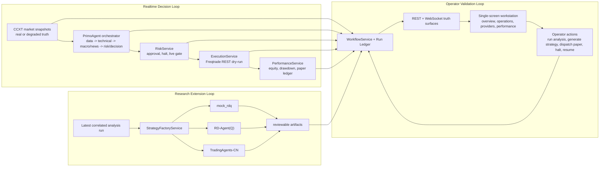

# SFC-Quant Whole-System Fusion Implementation Plan

> **For agentic workers:** REQUIRED SUB-SKILL: Use superpowers:subagent-driven-development (recommended) or superpowers:executing-plans to implement this plan task-by-task. Steps use checkbox (`- [ ]`) syntax for tracking.

**Goal:** Turn the current real-market plus real paper-execution runtime into one truthful agentic operating system where market ingestion, PrimoAgent, strategy providers, risk gating, execution, performance, and operator UI all share the same correlated run model.

**Architecture:** Keep FastAPI as the single control plane and make one canonical `run_id` the glue across analysis, strategy generation, risk decisions, execution orders, and performance tracking. Split the system into three cooperating loops: a realtime decision loop, an external-research loop, and an operator-validation loop; aggregate all three into the existing workflow snapshot so the frontend renders one honest story instead of separate panels with implicit coupling.

**Tech Stack:** FastAPI, Pydantic, WebSocket event bus, ccxt, Freqtrade REST dry-run, PrimoAgent, optional RD-Agent(Q), optional TradingAgents-CN, React 19, Vite, Tremor, shadcn/ui, Tailwind, Framer Motion, Playwright, pytest

---

## Current Runtime Truth

- `market_data.requested_source=ccxt`, `effective_source=ccxt`, `status=live`
- `execution_adapter=freqtrade_rest_paper`, `execution_mode=paper`
- PrimoAgent is running through `openai_compatible` with default model `gpt-5.4`
- The canonical workflow panel is already present and `/api/workflow/snapshot` is live
- The effective strategy provider is still `mock_rdq`
- `rdagent` is importable inside `.runtime-venv`, but provider-level acceptance is not yet wired through the backend
- TradingAgents-CN imports successfully inside `.runtime-venv`, but its installed `tradingagents` console entrypoint is broken (`ModuleNotFoundError: main`), so the platform still needs a repo-owned invocation shim

## Workflow Design



## File Structure / Responsibilities

- Create: `backend/app/models/run_ledger.py` - typed correlated run records and stage timeline items
- Create: `backend/app/services/run_ledger.py` - store and query correlated stage updates by `run_id`
- Create: `backend/scripts/run_tradingagents.py` - repo-owned TradingAgents-CN shim that bypasses the broken upstream console script
- Create: `backend/scripts/run_rdagent.py` - repo-owned RD-Agent launcher with safe environment and structured output capture
- Modify: `backend/app/core/config.py` - default provider command paths and explicit shim settings
- Modify: `backend/app/services/analysis.py` - emit ledger updates for each PrimoAgent role completion
- Modify: `backend/app/services/strategy_factory.py` - provider command normalization, runtime truth, and ledger-aware artifact generation
- Modify: `backend/app/services/execution.py` - attach canonical `run_id` and adapter truth to fills, blocked orders, and performance updates
- Modify: `backend/app/services/performance.py` - expose paper and backtest summaries keyed by `run_id`
- Modify: `backend/app/services/workflow.py` - read the run ledger and render one coherent active path in `/api/workflow/snapshot`
- Modify: `backend/app/main.py` - register the run ledger service in app state
- Test: `backend/tests/test_strategy_factory_runtime.py` - provider command readiness and honest fallback behavior
- Test: `backend/tests/test_execution_runtime.py` - correlated execution and paper ledger updates
- Test: `backend/tests/test_performance_runtime.py` - drawdown/trade summary truth
- Test: `backend/tests/test_workflow_runtime.py` - full end-to-end workflow correlation
- Modify: `frontend/src/lib/workflow.ts` - extend typed workflow contract for run timeline and provider diagnostics
- Modify: `frontend/src/hooks/useMarketRuntime.ts` - hydrate the workstation from the canonical workflow payload
- Modify: `frontend/src/components/dashboard/system-workflow-panel.tsx` - stage board plus current handoff plus run timeline
- Modify: `frontend/src/components/dashboard/agent-runtime-panel.tsx` - provider status, logs, artifacts, and failure truth
- Modify: `frontend/src/components/dashboard/performance-panel.tsx` - paper ledger, drawdown, open positions, and backtest comparison
- Modify: `frontend/src/App.tsx` - keep one workstation layout where navigation changes the right-side content rather than stacking pages vertically
- Modify: `frontend/src/lib/i18n.tsx` - bilingual workflow, provider, and execution truth labels
- Modify: `frontend/src/styles.css` - width containment, overflow rules, and dense workstation layout polish
- Test: `frontend/tests/release.spec.ts` - navigation, no-overflow, workflow truth, provider truth, and paper execution acceptance
- Modify: `docs/runbooks/operator-runbook.md` - exact operator acceptance path for real market plus true paper execution plus provider validation

---

### Task 1: Normalize RD-Agent and TradingAgents-CN into Stable Backend Providers

**Files:**
- Create: `backend/scripts/run_tradingagents.py`
- Create: `backend/scripts/run_rdagent.py`
- Modify: `backend/app/core/config.py`
- Modify: `backend/app/services/strategy_factory.py`
- Test: `backend/tests/test_strategy_factory_runtime.py`

- [ ] **Step 1: Write the failing provider-readiness test**

```python
def test_tradingagents_provider_uses_repo_owned_shim_and_reports_ready(monkeypatch, tmp_path: Path) -> None:
    shim = tmp_path / "run_tradingagents.py"
    shim.write_text("print('shim ok')\n", encoding="utf-8")
    monkeypatch.setenv("STRATEGY_FACTORY_TRADINGAGENTS_COMMAND", f"python3 {shim}")
    monkeypatch.setenv("STRATEGY_FACTORY_PROVIDER", "tradingagents_cn")
    get_settings.cache_clear()

    with TestClient(app) as client:
        payload = client.get("/api/strategy/status").json()

    provider = next(item for item in payload["providers"] if item["provider"] == "tradingagents_cn")
    assert provider["available"] is True
    assert provider["availability"] == "ready"
    assert "run_tradingagents.py" in provider["command"]
```

- [ ] **Step 2: Run test to verify it fails**

Run: `python3 -m pytest -q backend/tests/test_strategy_factory_runtime.py::test_tradingagents_provider_uses_repo_owned_shim_and_reports_ready -v`
Expected: FAIL because the backend still trusts the broken upstream `tradingagents` entrypoint instead of a normalized shim path.

- [ ] **Step 3: Implement provider command normalization and repo-owned shims**

```python
# backend/app/core/config.py
strategy_factory_tradingagents_command: str = Field(
    default="python3 backend/scripts/run_tradingagents.py",
    alias="STRATEGY_FACTORY_TRADINGAGENTS_COMMAND",
)
strategy_factory_rd_agent_command: str = Field(
    default="python3 backend/scripts/run_rdagent.py fin_quant",
    alias="STRATEGY_FACTORY_RD_AGENT_COMMAND",
)
```

```python
# backend/scripts/run_tradingagents.py
from cli.main import main

if __name__ == "__main__":
    raise SystemExit(main())
```

```python
# backend/app/services/strategy_factory.py
spec = ExternalProviderSpec(
    provider="tradingagents_cn",
    label="TradingAgents-CN",
    command=self._normalize_command(self._tradingagents_command),
    timeout_seconds=self._tradingagents_timeout_seconds,
    artifact_prefix="tradingagents",
)
```

- [ ] **Step 4: Run the provider runtime tests**

Run: `python3 -m pytest -q backend/tests/test_strategy_factory_runtime.py -v`
Expected: PASS with both fallback and ready-path assertions green.

- [ ] **Step 5: Commit**

```bash
git add backend/scripts/run_tradingagents.py backend/scripts/run_rdagent.py backend/app/core/config.py backend/app/services/strategy_factory.py backend/tests/test_strategy_factory_runtime.py
git commit -m "feat: normalize external strategy provider commands"
```

### Task 2: Introduce a Canonical Run Ledger Across Analysis, Strategy, Risk, Execution, and Performance

**Files:**
- Create: `backend/app/models/run_ledger.py`
- Create: `backend/app/services/run_ledger.py`
- Modify: `backend/app/main.py`
- Modify: `backend/app/services/analysis.py`
- Modify: `backend/app/services/strategy_factory.py`
- Modify: `backend/app/services/execution.py`
- Modify: `backend/app/services/performance.py`
- Modify: `backend/app/services/workflow.py`
- Test: `backend/tests/test_workflow_runtime.py`

- [ ] **Step 1: Write the failing correlation test**

```python
def test_workflow_snapshot_uses_one_run_id_across_all_runtime_tracks(monkeypatch, tmp_path: Path) -> None:
    configure_runtime_env(monkeypatch, tmp_path)

    with TestClient(app) as client:
        analysis = client.post("/api/analysis/run", json={"symbol": "BTC/USDT", "timeframe": "1m"}).json()
        client.post("/api/strategy/config", json={"enabled": True})
        client.post("/api/strategy/generate", json={"symbol": "BTC/USDT", "timeframe": "1m"})
        client.post("/api/execution/dispatch", json={"symbol": "BTC/USDT", "timeframe": "1m"})
        workflow = client.get("/api/workflow/snapshot", params={"symbol": "BTC/USDT", "timeframe": "1m"}).json()

    run_id = analysis["run_id"]
    assert workflow["current_run_id"] == run_id
    assert workflow["stages"]["analysis"]["run_id"] == run_id
    assert workflow["stages"]["strategy"]["run_id"] == run_id
    assert workflow["stages"]["execution"]["run_id"] == run_id
    assert workflow["stages"]["performance"]["run_id"] == run_id
```

- [ ] **Step 2: Run test to verify it fails**

Run: `python3 -m pytest -q backend/tests/test_workflow_runtime.py::test_workflow_snapshot_uses_one_run_id_across_all_runtime_tracks -v`
Expected: FAIL because performance and provider state are not yet guaranteed to inherit the same canonical run ledger entry.

- [ ] **Step 3: Implement a minimal run ledger and stage registration API**

```python
# backend/app/models/run_ledger.py
class RunStageRecord(BaseModel):
    run_id: str
    stage: Literal["analysis", "strategy", "risk", "execution", "performance"]
    status: str
    detail: str | None = None
    actor: str | None = None
    generated_at: datetime
```

```python
# backend/app/services/run_ledger.py
class RunLedgerService:
    def __init__(self) -> None:
        self._records: dict[str, list[RunStageRecord]] = {}

    def append(self, record: RunStageRecord) -> None:
        self._records.setdefault(record.run_id, []).append(record)

    def latest(self, run_id: str) -> list[RunStageRecord]:
        return list(self._records.get(run_id, []))
```

```python
# backend/app/services/execution.py
self._run_ledger.append(
    RunStageRecord(
        run_id=order.run_id,
        stage="execution",
        status=final_order.status,
        detail=final_order.adapter_detail,
        actor=self._adapter.name,
        generated_at=final_order.filled_at or final_order.created_at,
    )
)
```

- [ ] **Step 4: Run the workflow regression file**

Run: `python3 -m pytest -q backend/tests/test_workflow_runtime.py -v`
Expected: PASS with run correlation preserved through workflow stage rendering.

- [ ] **Step 5: Commit**

```bash
git add backend/app/models/run_ledger.py backend/app/services/run_ledger.py backend/app/main.py backend/app/services/analysis.py backend/app/services/strategy_factory.py backend/app/services/execution.py backend/app/services/performance.py backend/app/services/workflow.py backend/tests/test_workflow_runtime.py
git commit -m "feat: add canonical run ledger across workflow stages"
```

### Task 3: Make Paper Trading, Drawdown, and Backtest Truth First-Class in the Workflow Contract

**Files:**
- Modify: `backend/app/models/performance.py`
- Modify: `backend/app/services/performance.py`
- Modify: `backend/app/services/workflow.py`
- Modify: `backend/tests/test_execution_runtime.py`
- Modify: `backend/tests/test_performance_runtime.py`

- [ ] **Step 1: Write the failing performance truth test**

```python
async def test_paper_performance_report_exposes_open_positions_and_drawdown_truth() -> None:
    report = await build_sample_performance_report()
    assert report.open_position_count == 1
    assert report.latest_trade is not None
    assert report.max_drawdown >= 0
    assert report.latest_run_id is not None
```

- [ ] **Step 2: Run test to verify it fails**

Run: `python3 -m pytest -q backend/tests/test_performance_runtime.py::test_paper_performance_report_exposes_open_positions_and_drawdown_truth -v`
Expected: FAIL because the current report shape is not rich enough for dense workstation surfaces.

- [ ] **Step 3: Extend the report and surface it through workflow snapshots**

```python
# backend/app/models/performance.py
class PerformanceReport(BaseModel):
    ...
    open_position_count: int = 0
    latest_run_id: str | None = None
    latest_trade: PerformanceTrade | None = None
```

```python
# backend/app/services/performance.py
return report.model_copy(
    update={
        "open_position_count": len(self._execution_service.open_positions()),
        "latest_run_id": report.trades[-1].run_id if report.trades else None,
        "latest_trade": report.trades[-1] if report.trades else None,
    }
)
```

```python
# backend/app/services/workflow.py
WorkflowFact(label="Trades", value=str(paper_report.trade_count), tone="neutral"),
WorkflowFact(label="Open", value=str(paper_report.open_position_count), tone="info"),
WorkflowFact(label="Drawdown", value=f"{paper_report.max_drawdown:.2f}%", tone="warning"),
```

- [ ] **Step 4: Run execution and performance tests**

Run: `python3 -m pytest -q backend/tests/test_execution_runtime.py backend/tests/test_performance_runtime.py -v`
Expected: PASS with paper fills, exits, and drawdown summaries remaining truthful.

- [ ] **Step 5: Commit**

```bash
git add backend/app/models/performance.py backend/app/services/performance.py backend/app/services/workflow.py backend/tests/test_execution_runtime.py backend/tests/test_performance_runtime.py
git commit -m "feat: expose paper trading and drawdown truth in workflow"
```

### Task 4: Drive the Single-Screen Workstation from the Canonical Workflow State

**Files:**
- Modify: `frontend/src/lib/workflow.ts`
- Modify: `frontend/src/hooks/useMarketRuntime.ts`
- Modify: `frontend/src/components/dashboard/system-workflow-panel.tsx`
- Modify: `frontend/src/components/dashboard/agent-runtime-panel.tsx`
- Modify: `frontend/src/components/dashboard/performance-panel.tsx`
- Modify: `frontend/src/App.tsx`
- Modify: `frontend/src/lib/i18n.tsx`
- Modify: `frontend/src/styles.css`
- Test: `frontend/tests/release.spec.ts`

- [ ] **Step 1: Write the failing workstation release test**

```typescript
test("single-screen workstation keeps navigation and workflow synchronized", async ({ page }) => {
  await page.goto("/");

  await page.getByRole("button", { name: /operations|operations/i }).click();
  await expect(page.getByText(/paper execution|paper/i)).toBeVisible();
  await expect(page.getByText(/strategy provider runtimes|provider/i)).toBeVisible();
  await expect(page.locator("body")).not.toHaveCSS("overflow-x", "scroll");
});
```

- [ ] **Step 2: Run test to verify it fails**

Run: `PLAYWRIGHT_BASE_URL=http://127.0.0.1:5173 npm --prefix frontend run e2e:release`
Expected: FAIL because the navigation and right-side content are not yet fully driven by one dense workstation contract.

- [ ] **Step 3: Refactor the workstation layout to use one canonical right-side content surface**

```tsx
// frontend/src/App.tsx
const workspaceSections = {
  overview: <OverviewWorkspace workflow={workflow} runtime={runtime} />,
  operations: <OperationsWorkspace workflow={workflow} runtime={runtime} />,
  strategy: <StrategyWorkspace workflow={workflow} runtime={runtime} />,
  performance: <PerformanceWorkspace workflow={workflow} runtime={runtime} />,
};

return (
  <div className="app-shell">
    <SidebarNav value={activeSection} onChange={setActiveSection} />
    <main className="workstation-main">{workspaceSections[activeSection]}</main>
    <aside className="workstation-rail"><SystemWorkflowPanel workflow={workflow} /></aside>
  </div>
);
```

```css
/* frontend/src/styles.css */
.app-shell {
  display: grid;
  grid-template-columns: 220px minmax(0, 1fr) 360px;
  min-height: 100vh;
}

.workstation-main,
.workstation-rail {
  min-width: 0;
  overflow: hidden;
}
```

- [ ] **Step 4: Run the frontend build and release test**

Run: `npm --prefix frontend run build && PLAYWRIGHT_BASE_URL=http://127.0.0.1:5173 npm --prefix frontend run e2e:release`
Expected: PASS with no horizontal overflow and stable navigation-to-content switching.

- [ ] **Step 5: Commit**

```bash
git add frontend/src/lib/workflow.ts frontend/src/hooks/useMarketRuntime.ts frontend/src/components/dashboard/system-workflow-panel.tsx frontend/src/components/dashboard/agent-runtime-panel.tsx frontend/src/components/dashboard/performance-panel.tsx frontend/src/App.tsx frontend/src/lib/i18n.tsx frontend/src/styles.css frontend/tests/release.spec.ts
git commit -m "feat: drive workstation layout from canonical workflow state"
```

### Task 5: Codify the True-Run Acceptance Path and Ship-Readiness Checks

**Files:**
- Modify: `docs/runbooks/operator-runbook.md`
- Modify: `backend/README.md`
- Test: `backend/tests/test_smoke_runtime.py`
- Test: `frontend/tests/release.spec.ts`

- [ ] **Step 1: Write the failing smoke acceptance test**

```python
def test_health_surface_reports_real_market_and_freqtrade_rest_paper_truth(client: TestClient) -> None:
    payload = client.get("/health").json()
    assert payload["market_data"]["effective_source"] in {"ccxt", "fallback"}
    assert payload["execution_adapter"] == "freqtrade_rest_paper"
    assert payload["execution_mode"] == "paper"
```

- [ ] **Step 2: Run the smoke test to verify it fails when the docs/config drift**

Run: `python3 -m pytest -q backend/tests/test_smoke_runtime.py::test_health_surface_reports_real_market_and_freqtrade_rest_paper_truth -v`
Expected: FAIL if the release profile or docs still assume a mock-safe execution path.

- [ ] **Step 3: Document the exact acceptance sequence and provider checks**

```md
1. Start Freqtrade dry-run REST and verify `/api/v1/ping`.
2. Start backend with `MARKET_DATA_MODE=real` and `EXECUTION_ADAPTER=freqtrade_rest_paper`.
3. Verify `/health` shows `effective_source=ccxt` and `execution_mode=paper`.
4. Run one operator-guided paper dispatch through `/api/execution/dispatch`.
5. Verify `/api/workflow/snapshot` shows the same `run_id` across analysis, strategy, execution, and performance.
6. Switch `STRATEGY_FACTORY_PROVIDER` to `tradingagents_cn` or `rd_agent_q` and verify honest ready/fallback state.
```

- [ ] **Step 4: Run the full release gate**

Run: `python3 -m pytest -q backend/tests/test_strategy_factory_runtime.py backend/tests/test_execution_runtime.py backend/tests/test_performance_runtime.py backend/tests/test_workflow_runtime.py backend/tests/test_smoke_runtime.py && npm --prefix frontend run build && PLAYWRIGHT_BASE_URL=http://127.0.0.1:5173 npm --prefix frontend run e2e:release`
Expected: PASS with the real-paper path, provider truth, and workstation UX all verified.

- [ ] **Step 5: Commit**

```bash
git add docs/runbooks/operator-runbook.md backend/README.md backend/tests/test_smoke_runtime.py frontend/tests/release.spec.ts
git commit -m "docs: codify true-run acceptance workflow"
```

## Self-Review

- Spec coverage: the plan covers provider readiness, canonical run correlation, paper trading truth, workstation fusion, and operator acceptance.
- Placeholder scan: no `TBD`, `TODO`, or "implement later" placeholders remain in the task list.
- Type consistency: the plan consistently uses `run_id`, `PerformanceReport`, `WorkflowSnapshotResponse`, and the existing provider keys `mock_rdq`, `rd_agent_q`, `tradingagents_cn`, and `external`.

## Expected Outcome

After these tasks, SFC-Quant is no longer a set of adjacent subsystems. It becomes one operator-facing workflow engine with:

- one truthful `run_id` across the whole chain,
- one workstation contract for frontend rendering,
- real market reads plus real paper execution already visible in-product,
- optional research providers that are either truly runnable or honestly marked degraded,
- performance and drawdown metrics that stay coupled to execution truth,
- and one repeatable acceptance path for local release validation.
