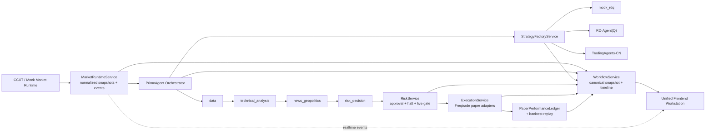

# Unified Agentic Workflow Implementation Plan

> **For agentic workers:** REQUIRED SUB-SKILL: Use superpowers:subagent-driven-development (recommended) or superpowers:executing-plans to implement this plan task-by-task. Steps use checkbox (`- [ ]`) syntax for tracking.

**Goal:** Fuse market ingestion, PrimoAgent analysis, strategy research providers, paper execution, and performance telemetry into one coherent workflow model and workstation surface.

**Architecture:** Introduce a canonical workflow snapshot service in FastAPI that aggregates market, analysis, strategy, risk, execution, and performance state under one correlated run model. Feed the frontend from that single source of truth so overview, strategy, analytics, and operations panels all render the same run, provider, and drawdown facts while WebSocket events simply refresh or increment the canonical snapshot.

**Tech Stack:** FastAPI, Pydantic, WebSocket event bus, React 19, Vite, TypeScript, Tremor, shadcn/ui, Tailwind, Framer Motion, Playwright, pytest

---

## Workflow Design



## File Structure / Responsibilities

- Create: `backend/app/models/workflow.py` — canonical workflow stage models, correlated snapshot DTOs and stage state items
- Create: `backend/app/services/workflow.py` — aggregate state from market/analysis/strategy/risk/execution/performance into one backend truth source
- Create: `backend/app/api/routes/workflow.py` — expose `/api/workflow/snapshot` as the canonical backend truth source
- Modify: `backend/app/main.py` — register `WorkflowService` and workflow routes in app lifespan
- Modify: `backend/app/services/analysis.py` — emit `run_id` and role metadata on `agent.role.completed`
- Modify: `backend/app/services/execution.py` — publish adapter/runtime payloads that can be rendered directly in the unified workflow view
- Modify: `backend/app/services/strategy_factory.py` — expose current provider phase/log/artifact state in a form the workflow service can reuse directly
- Modify: `backend/app/services/performance.py` — provide summarized paper/backtest facts for canonical snapshot consumption
- Test: `backend/tests/test_workflow_runtime.py` — route, correlation, and stage regression coverage
- Create: `frontend/src/lib/workflow.ts` — typed workflow snapshot client + normalizers
- Modify: `frontend/src/hooks/useMarketRuntime.ts` — load one canonical workflow snapshot, then fan out derived state for existing panels
- Create: `frontend/src/components/dashboard/system-workflow-panel.tsx` — system-level stage graph showing one current run across Market → Analysis → Strategy → Risk → Execution → Performance
- Modify: `frontend/src/components/dashboard/agent-runtime-panel.tsx` — consume canonical workflow ids/stages instead of piecemeal event-only inference
- Modify: `frontend/src/components/dashboard/performance-panel.tsx` — display workflow-correlated paper/backtest details and latest-trade linkage
- Modify: `frontend/src/App.tsx` — place unified workflow graph in overview + operations surfaces and pass canonical workflow props to subpanels
- Modify: `frontend/src/lib/i18n.tsx` — add bilingual workflow strings
- Modify: `frontend/src/styles.css` — add layout/stage graph styles while preserving current terminal shell proportions
- Test: `frontend/tests/release.spec.ts` — release walkthrough asserting workflow graph, synchronized run id, strategy provider truth, and performance truth
- Modify: `docs/runbooks/operator-runbook.md` — document the operator path through the unified workflow
- Create: `docs/architecture/unified-agentic-workflow.md` — architecture-level explanation of the fused system

---

### Task 1: Add a Canonical Workflow Snapshot API

**Files:**
- Create: `backend/app/models/workflow.py`
- Create: `backend/app/services/workflow.py`
- Create: `backend/app/api/routes/workflow.py`
- Modify: `backend/app/main.py`
- Test: `backend/tests/test_workflow_runtime.py`

- [ ] **Step 1: Write the failing backend route test**

```python
from pathlib import Path

from fastapi.testclient import TestClient

from app.core.config import get_settings
from app.main import app


def configure_runtime_env(monkeypatch, tmp_path: Path) -> None:
    monkeypatch.setenv("APP_MODE", "mock")
    monkeypatch.setenv("AI_PROVIDER", "mock")
    monkeypatch.setenv("MARKET_DATA_MODE", "mock")
    monkeypatch.setenv("MARKET_SYMBOLS", "BTC/USDT")
    monkeypatch.setenv("MARKET_TIMEFRAMES", "1m")
    monkeypatch.setenv("MARKET_STREAM_ENABLED", "false")
    monkeypatch.setenv("EVENT_LOG_DIR", str(tmp_path / "events"))
    monkeypatch.setenv("EXECUTION_ADAPTER", "freqtrade_mock")
    get_settings.cache_clear()


def test_workflow_snapshot_route_returns_all_stage_groups(monkeypatch, tmp_path: Path) -> None:
    configure_runtime_env(monkeypatch, tmp_path)

    with TestClient(app) as client:
        response = client.get("/api/workflow/snapshot")

    assert response.status_code == 200
    payload = response.json()
    assert payload["current_run_id"] is None
    assert set(payload["stages"].keys()) == {
        "market",
        "analysis",
        "strategy",
        "risk",
        "execution",
        "performance",
    }
    assert payload["strategy_runtime"]["effective_provider"] == "mock_rdq"
    assert payload["execution"]["execution_mode"] == "paper"
    get_settings.cache_clear()
```

- [ ] **Step 2: Run test to verify it fails**

Run: `python3 -m pytest -q backend/tests/test_workflow_runtime.py::test_workflow_snapshot_route_returns_all_stage_groups`
Expected: FAIL with `404 Not Found` for `/api/workflow/snapshot`

- [ ] **Step 3: Write the minimal workflow model, service, route, and app wiring**

```python
# backend/app/models/workflow.py
from datetime import datetime
from typing import Literal

from pydantic import BaseModel, Field

from app.models.analysis import AnalysisRunResult
from app.models.execution import ExecutionStatusResponse
from app.models.performance import BacktestRunRequest, PerformanceReport
from app.models.strategy import AgentRuntimeSummaryResponse, StrategyFactoryStatusResponse
from app.models.events import EventEnvelope, MarketSnapshotResponse
from app.models.risk import RiskStatusResponse

WorkflowStageKey = Literal["market", "analysis", "strategy", "risk", "execution", "performance"]
WorkflowStageStatus = Literal["idle", "ready", "running", "blocked", "completed", "degraded", "failed"]


class WorkflowStageState(BaseModel):
    key: WorkflowStageKey
    status: WorkflowStageStatus
    label: str
    detail: str | None = None
    run_id: str | None = None
    updated_at: datetime | None = None


class WorkflowSnapshotResponse(BaseModel):
    generated_at: datetime
    current_run_id: str | None = None
    market_snapshot: MarketSnapshotResponse
    latest_analysis: AnalysisRunResult | None = None
    strategy_runtime: StrategyFactoryStatusResponse
    agent_runtime: AgentRuntimeSummaryResponse
    execution: ExecutionStatusResponse
    risk: RiskStatusResponse
    paper_performance: PerformanceReport
    backtest_performance: PerformanceReport | None = None
    stages: dict[WorkflowStageKey, WorkflowStageState] = Field(default_factory=dict)
    recent_events: list[EventEnvelope] = Field(default_factory=list)
```

```python
# backend/app/services/workflow.py
from datetime import datetime, timezone

from app.models.workflow import WorkflowSnapshotResponse, WorkflowStageState


class WorkflowService:
    def __init__(
        self,
        *,
        market_service,
        analysis_service,
        strategy_factory_service,
        execution_service,
        risk_service,
        performance_service,
        event_bus,
    ) -> None:
        self._market_service = market_service
        self._analysis_service = analysis_service
        self._strategy_factory_service = strategy_factory_service
        self._execution_service = execution_service
        self._risk_service = risk_service
        self._performance_service = performance_service
        self._event_bus = event_bus

    async def snapshot(self, *, symbol: str | None = None, timeframe: str | None = None) -> WorkflowSnapshotResponse:
        market_snapshot = await self._market_service.snapshot_response()
        selected_symbol = symbol or (market_snapshot.snapshots[0].symbol if market_snapshot.snapshots else None)
        selected_timeframe = timeframe or (market_snapshot.snapshots[0].timeframe if market_snapshot.snapshots else None)
        analysis = (
            self._analysis_service.latest_analysis(symbol=selected_symbol, timeframe=selected_timeframe)
            if selected_symbol and selected_timeframe
            else None
        )
        strategy = self._strategy_factory_service.status()
        agent_runtime = self._strategy_factory_service.agent_runtime()
        execution = self._execution_service.status()
        risk = self._risk_service.status()
        paper = self._performance_service.paper_report()
        backtest = None
        if selected_symbol and selected_timeframe:
            backtest = await self._performance_service.run_backtest(
                BacktestRunRequest(symbol=selected_symbol, timeframe=selected_timeframe)
            )

        current_run_id = analysis.run_id if analysis else execution.last_run_id
        stages = {
            "market": WorkflowStageState(key="market", status="ready", label="Market", detail=market_snapshot.market_data.detail),
            "analysis": WorkflowStageState(key="analysis", status="completed" if analysis else "idle", label="PrimoAgent", run_id=analysis.run_id if analysis else None, updated_at=analysis.completed_at if analysis else None),
            "strategy": WorkflowStageState(key="strategy", status="running" if strategy.generation.status == "running" else "completed" if strategy.latest_artifact else "idle", label="Strategy Factory", run_id=strategy.latest_artifact.run_id if strategy.latest_artifact else None, updated_at=strategy.generation.updated_at),
            "risk": WorkflowStageState(key="risk", status="blocked" if risk.halted else "ready", label="Risk Guard", detail=risk.halt_reason or risk.live_mode_reason),
            "execution": WorkflowStageState(key="execution", status="running" if execution.engine_status == "running" else "ready", label="Paper Execution", run_id=execution.last_run_id, updated_at=execution.recent_orders[0].filled_at if execution.recent_orders else None),
            "performance": WorkflowStageState(key="performance", status="completed" if paper.trade_count else "idle", label="Performance", run_id=paper.trades[-1].run_id if paper.trades else None),
        }
        return WorkflowSnapshotResponse(
            generated_at=datetime.now(timezone.utc),
            current_run_id=current_run_id,
            market_snapshot=market_snapshot,
            latest_analysis=analysis,
            strategy_runtime=strategy,
            agent_runtime=agent_runtime,
            execution=execution,
            risk=risk,
            paper_performance=paper,
            backtest_performance=backtest,
            stages=stages,
            recent_events=self._event_bus.get_recent_events(limit=30),
        )
```

```python
# backend/app/api/routes/workflow.py
from fastapi import APIRouter, Request

from app.models.workflow import WorkflowSnapshotResponse

router = APIRouter(prefix="/api/workflow", tags=["workflow"])


@router.get("/snapshot", response_model=WorkflowSnapshotResponse)
async def get_workflow_snapshot(
    request: Request,
    symbol: str | None = None,
    timeframe: str | None = None,
) -> WorkflowSnapshotResponse:
    return await request.app.state.workflow_service.snapshot(symbol=symbol, timeframe=timeframe)
```

```python
# backend/app/main.py (relevant additions)
from app.api.routes.workflow import router as workflow_router
from app.services.workflow import WorkflowService

workflow_service = WorkflowService(
    market_service=market_service,
    analysis_service=analysis_service,
    strategy_factory_service=strategy_factory_service,
    execution_service=execution_service,
    risk_service=risk_service,
    performance_service=performance_service,
    event_bus=event_bus,
)
app.state.workflow_service = workflow_service
app.include_router(workflow_router)
```

- [ ] **Step 4: Run the targeted backend test to verify it passes**

Run: `python3 -m pytest -q backend/tests/test_workflow_runtime.py::test_workflow_snapshot_route_returns_all_stage_groups`
Expected: PASS with `1 passed`

- [ ] **Step 5: Commit**

```bash
git add backend/app/models/workflow.py backend/app/services/workflow.py backend/app/api/routes/workflow.py backend/app/main.py backend/tests/test_workflow_runtime.py
git commit -m "feat: add canonical workflow snapshot api"
```

### Task 2: Correlate Run IDs and Normalize Workflow Event Payloads

**Files:**
- Modify: `backend/app/services/analysis.py`
- Modify: `backend/app/services/execution.py`
- Modify: `backend/app/services/strategy_factory.py`
- Modify: `backend/app/services/workflow.py`
- Test: `backend/tests/test_workflow_runtime.py`

- [ ] **Step 1: Write the failing correlation test**

```python
def test_workflow_snapshot_correlates_run_ids_and_role_events(monkeypatch, tmp_path: Path) -> None:
    configure_runtime_env(monkeypatch, tmp_path)

    with TestClient(app) as client:
        analysis_response = client.post("/api/analysis/run", json={"symbol": "BTC/USDT", "timeframe": "1m"})
        assert analysis_response.status_code == 200
        run_id = analysis_response.json()["run_id"]

        config_response = client.post("/api/strategy/config", json={"enabled": True})
        assert config_response.status_code == 200

        strategy_response = client.post("/api/strategy/generate", json={"symbol": "BTC/USDT", "timeframe": "1m"})
        assert strategy_response.status_code == 200

        execution_response = client.post("/api/execution/dispatch", json={"symbol": "BTC/USDT", "timeframe": "1m"})
        assert execution_response.status_code == 200

        workflow_payload = client.get("/api/workflow/snapshot", params={"symbol": "BTC/USDT", "timeframe": "1m"}).json()
        recent_events = client.get("/api/events/recent", params={"limit": 20}).json()

    role_event = next(event for event in recent_events if event["event_type"] == "agent.role.completed")
    assert workflow_payload["current_run_id"] == run_id
    assert workflow_payload["stages"]["analysis"]["run_id"] == run_id
    assert workflow_payload["stages"]["strategy"]["run_id"] == run_id
    assert workflow_payload["stages"]["execution"]["run_id"] == run_id
    assert role_event["payload"]["run_id"] == run_id
    assert role_event["payload"]["provider"]
    assert role_event["payload"]["model"]
    get_settings.cache_clear()
```

- [ ] **Step 2: Run test to verify it fails**

Run: `python3 -m pytest -q backend/tests/test_workflow_runtime.py::test_workflow_snapshot_correlates_run_ids_and_role_events`
Expected: FAIL because `agent.role.completed` payload does not contain `run_id`, and the workflow stage correlation is incomplete

- [ ] **Step 3: Add correlated metadata to analysis events and workflow stage derivation**

```python
# backend/app/services/analysis.py (relevant changes)
for role in ROLE_SEQUENCE:
    output = await self._run_role(
        role=role,
        request=request,
        market_snapshot=market_snapshot,
        prior_outputs=outputs,
        configured_provider=selection.provider,
        run_id=run_id,
    )

async def _run_role(
    self,
    *,
    role: AgentRole,
    request: AnalysisRunRequest,
    market_snapshot: MarketSnapshot,
    prior_outputs: list[AgentAnalysisResult],
    configured_provider,
    run_id: str,
) -> AgentAnalysisResult:
    ...
    await self._event_bus.publish(
        event_type="agent.role.completed",
        source=f"primoagent.{role}",
        payload={
            "run_id": run_id,
            "symbol": request.symbol,
            "timeframe": request.timeframe,
            "run_role": role,
            "provider": result.provider,
            "model": result.model,
            "latency_ms": result.latency_ms,
            "recommendation": result.recommendation,
            "confidence": result.confidence,
            "output": result.model_dump(mode="json"),
        },
    )
```

```python
# backend/app/services/workflow.py (relevant changes)
strategy_run_id = strategy.latest_artifact.run_id if strategy.latest_artifact else None
execution_run_id = execution.last_run_id
performance_run_id = paper.trades[-1].run_id if paper.trades else None
current_run_id = analysis.run_id if analysis else strategy_run_id or execution_run_id or performance_run_id

stages["strategy"] = WorkflowStageState(
    key="strategy",
    status="running" if strategy.generation.status == "running" else "completed" if strategy.latest_artifact else "idle",
    label="Strategy Factory",
    detail=strategy.generation.detail or strategy.reason,
    run_id=strategy_run_id,
    updated_at=strategy.generation.updated_at,
)
stages["execution"] = WorkflowStageState(
    key="execution",
    status="running" if execution.engine_status == "running" else "ready",
    label="Paper Execution",
    detail=execution.adapter_runtime.detail,
    run_id=execution_run_id,
    updated_at=execution.recent_orders[0].filled_at if execution.recent_orders else None,
)
stages["performance"] = WorkflowStageState(
    key="performance",
    status="completed" if paper.trade_count else "idle",
    label="Performance",
    detail=f"max drawdown {paper.max_drawdown}%",
    run_id=performance_run_id,
    updated_at=paper.trades[-1].closed_at if paper.trades else None,
)
```

- [ ] **Step 4: Run the backend workflow test file**

Run: `python3 -m pytest -q backend/tests/test_workflow_runtime.py`
Expected: PASS with all workflow route/correlation tests green

- [ ] **Step 5: Commit**

```bash
git add backend/app/services/analysis.py backend/app/services/execution.py backend/app/services/strategy_factory.py backend/app/services/workflow.py backend/tests/test_workflow_runtime.py
git commit -m "feat: correlate workflow stages with canonical run ids"
```

### Task 3: Move the Frontend Runtime Hook to the Canonical Workflow Contract

**Files:**
- Create: `frontend/src/lib/workflow.ts`
- Modify: `frontend/src/hooks/useMarketRuntime.ts`
- Modify: `frontend/src/lib/market.ts`
- Test: `frontend/tests/release.spec.ts`

- [ ] **Step 1: Extend the release test with a failing workflow snapshot expectation**

```typescript
import { expect, test } from "@playwright/test";

test("SFC-Quant unified workflow panel stays synchronized across sections", async ({ page }) => {
  await page.goto("/");

  await expect(page.getByRole("heading", { level: 3, name: "统一工作流" })).toBeVisible();
  await expect(page.getByText("市场", { exact: false })).toBeVisible();
  await expect(page.getByText("PrimoAgent", { exact: false })).toBeVisible();
  await expect(page.getByText("纸面执行", { exact: false })).toBeVisible();
});
```

- [ ] **Step 2: Run the release test to verify it fails**

Run: `PLAYWRIGHT_BASE_URL=http://127.0.0.1:5173 npm --prefix frontend run e2e:release`
Expected: FAIL because no unified workflow panel exists yet and the runtime hook does not load `/api/workflow/snapshot`

- [ ] **Step 3: Add a workflow client and hydrate the existing runtime hook from one backend snapshot**

```typescript
// frontend/src/lib/workflow.ts
import { resolveBackendBaseUrl, type AgentRuntimeSummaryResponse, type ExecutionStatusResponse, type MarketSnapshotResponse, type PerformanceReport, type RiskStatusResponse, type StrategyFactoryStatusResponse, type AnalysisRunResult, type EventEnvelope } from "./market";

export type WorkflowStageView = {
  key: "market" | "analysis" | "strategy" | "risk" | "execution" | "performance";
  status: "idle" | "ready" | "running" | "blocked" | "completed" | "degraded" | "failed";
  label: string;
  detail: string | null;
  run_id: string | null;
  updated_at: string | null;
};

export type WorkflowSnapshot = {
  generated_at: string;
  current_run_id: string | null;
  market_snapshot: MarketSnapshotResponse;
  latest_analysis: AnalysisRunResult | null;
  strategy_runtime: StrategyFactoryStatusResponse;
  agent_runtime: AgentRuntimeSummaryResponse;
  execution: ExecutionStatusResponse;
  risk: RiskStatusResponse;
  paper_performance: PerformanceReport;
  backtest_performance: PerformanceReport | null;
  stages: Record<WorkflowStageView["key"], WorkflowStageView>;
  recent_events: EventEnvelope[];
};

export async function loadWorkflowSnapshot(symbol?: string, timeframe?: string): Promise<WorkflowSnapshot> {
  const search = new URLSearchParams();
  if (symbol) search.set("symbol", symbol);
  if (timeframe) search.set("timeframe", timeframe);
  const suffix = search.size > 0 ? `?${search.toString()}` : "";
  const response = await fetch(`${resolveBackendBaseUrl()}/api/workflow/snapshot${suffix}`);
  if (!response.ok) {
    throw new Error(`workflow snapshot failed with ${response.status}`);
  }
  return (await response.json()) as WorkflowSnapshot;
}
```

```typescript
// frontend/src/hooks/useMarketRuntime.ts (relevant changes)
import { loadWorkflowSnapshot, type WorkflowSnapshot } from "../lib/workflow";

const [workflow, setWorkflow] = useState<WorkflowSnapshot | null>(null);

const refreshAll = useCallback(async () => {
  const nextWorkflow = await loadWorkflowSnapshot(
    selectedInstrumentRef.current.symbol,
    selectedInstrumentRef.current.timeframe,
  );

  if (!activeRef.current) {
    return;
  }

  setWorkflow(nextWorkflow);
  setSnapshot(nextWorkflow.market_snapshot);
  setExecution(nextWorkflow.execution);
  setRisk(nextWorkflow.risk);
  setStrategyStatus(nextWorkflow.strategy_runtime);
  setAgentRuntime(nextWorkflow.agent_runtime);
  setPaperPerformance(nextWorkflow.paper_performance);
  setBacktestReport(nextWorkflow.backtest_performance);
  setLatestAnalysis(nextWorkflow.latest_analysis);
  setEventFeed(clampEvents(nextWorkflow.recent_events));
}, []);

if (event.event_type !== "market.tick") {
  void refreshAll();
}
```

- [ ] **Step 4: Run type-check/build to verify the hook compiles with the new workflow client**

Run: `npm --prefix frontend run build`
Expected: PASS with Vite production bundle emitted under `frontend/dist`

- [ ] **Step 5: Commit**

```bash
git add frontend/src/lib/workflow.ts frontend/src/hooks/useMarketRuntime.ts frontend/src/lib/market.ts frontend/tests/release.spec.ts
git commit -m "feat: hydrate frontend runtime from unified workflow snapshot"
```

### Task 4: Render a System-Level Workflow Graph that Reuses Existing Panels

**Files:**
- Create: `frontend/src/components/dashboard/system-workflow-panel.tsx`
- Modify: `frontend/src/App.tsx`
- Modify: `frontend/src/components/dashboard/agent-runtime-panel.tsx`
- Modify: `frontend/src/components/dashboard/performance-panel.tsx`
- Modify: `frontend/src/lib/i18n.tsx`
- Modify: `frontend/src/styles.css`
- Test: `frontend/tests/release.spec.ts`

- [ ] **Step 1: Add a failing release assertion for synchronized run id and stage cards**

```typescript
await expect(page.getByText("当前运行", { exact: false })).toBeVisible();
await expect(page.getByText("策略工厂", { exact: false })).toBeVisible();
await expect(page.getByText("绩效", { exact: false })).toBeVisible();
await expect(page.getByRole("button", { name: "运行回测" })).toBeVisible();
```

- [ ] **Step 2: Run the release test to verify it fails**

Run: `PLAYWRIGHT_BASE_URL=http://127.0.0.1:5173 npm --prefix frontend run e2e:release`
Expected: FAIL because the new workflow graph copy and synchronized run-id surface do not exist

- [ ] **Step 3: Create the workflow graph component and place it in the overview/operations composition**

```tsx
// frontend/src/components/dashboard/system-workflow-panel.tsx
import { Badge } from "@tremor/react/dist/components/text-elements/Badge/Badge";

import { useLocale } from "../../lib/i18n";
import type { WorkflowSnapshot } from "../../lib/workflow";

const STAGE_ORDER = ["market", "analysis", "strategy", "risk", "execution", "performance"] as const;

export function SystemWorkflowPanel({ workflow }: { workflow: WorkflowSnapshot | null }) {
  const { t, formatDateTime } = useLocale();

  if (!workflow) {
    return null;
  }

  return (
    <div className="extension-card workflow-system-card">
      <div className="extension-card-headline">
        <div>
          <span className="section-label">{t("workflow.kicker")}</span>
          <h3>{t("workflow.title")}</h3>
        </div>
        <Badge color="cyan">{workflow.current_run_id ?? t("workflow.noRun")}</Badge>
      </div>
      <div className="workflow-stage-grid">
        {STAGE_ORDER.map((key) => {
          const stage = workflow.stages[key];
          return (
            <article className="workflow-stage-card" data-status={stage.status} key={stage.key}>
              <span className="section-label">{t(`workflow.stage.${stage.key}`)}</span>
              <strong>{t(`workflow.status.${stage.status}`)}</strong>
              <p className="clamp-2 copy-break" title={stage.detail ?? "-"}>{stage.detail ?? "-"}</p>
              <small>{stage.updated_at ? formatDateTime(stage.updated_at) : t("workflow.noTimestamp")}</small>
            </article>
          );
        })}
      </div>
    </div>
  );
}
```

```tsx
// frontend/src/App.tsx (relevant changes)
import { SystemWorkflowPanel } from "./components/dashboard/system-workflow-panel";

const {
  workflow,
  ...runtime
} = useMarketRuntime();

const overviewPanel = (
  <div className="workspace-stack workspace-column-wide">
    <SystemWorkflowPanel workflow={workflow} />
    {marketDeckPanel}
    {thesisPanel}
  </div>
);
```

```tsx
// frontend/src/components/dashboard/agent-runtime-panel.tsx (relevant changes)
export function AgentRuntimePanel({ workflow, latestAnalysis, agentRuntime, execution, eventFeed }: Props) {
  const currentRunId = workflow?.current_run_id;
  ...
  <strong>{currentRunId ?? t("workflow.noRun")}</strong>
}
```

```tsx
// frontend/src/components/dashboard/performance-panel.tsx (relevant changes)
<article className="runtime-overview-item runtime-overview-item--compact">
  <div className="runtime-overview-line">
    <span>{t("workflow.currentRun")}</span>
    <strong>{report.trades.at(-1)?.run_id ?? t("workflow.noRun")}</strong>
  </div>
  <p>{t("performance.maxDrawdown")}: {formatPercent(-Math.abs(report.max_drawdown))}</p>
</article>
```

```tsx
// frontend/src/lib/i18n.tsx (new keys in `en`)
"workflow.kicker": "System Workflow",
"workflow.title": "Unified Workflow",
"workflow.currentRun": "Current run",
"workflow.noRun": "No correlated run",
"workflow.noTimestamp": "No timestamp yet",
"workflow.stage.market": "Market",
"workflow.stage.analysis": "PrimoAgent",
"workflow.stage.strategy": "Strategy Factory",
"workflow.stage.risk": "Risk Guard",
"workflow.stage.execution": "Paper Execution",
"workflow.stage.performance": "Performance",
"workflow.status.idle": "Idle",
"workflow.status.ready": "Ready",
"workflow.status.running": "Running",
"workflow.status.blocked": "Blocked",
"workflow.status.completed": "Completed",
"workflow.status.degraded": "Degraded",
"workflow.status.failed": "Failed",

// frontend/src/lib/i18n.tsx (new keys in `zh-CN`)
"workflow.kicker": "系统工作流",
"workflow.title": "统一工作流",
"workflow.currentRun": "当前运行",
"workflow.noRun": "暂无关联运行",
"workflow.noTimestamp": "暂无时间戳",
"workflow.stage.market": "市场",
"workflow.stage.analysis": "PrimoAgent",
"workflow.stage.strategy": "策略工厂",
"workflow.stage.risk": "风险护栏",
"workflow.stage.execution": "纸面执行",
"workflow.stage.performance": "绩效",
"workflow.status.idle": "空闲",
"workflow.status.ready": "就绪",
"workflow.status.running": "运行中",
"workflow.status.blocked": "阻塞",
"workflow.status.completed": "已完成",
"workflow.status.degraded": "降级",
"workflow.status.failed": "失败",
```

```css
/* frontend/src/styles.css */
.workflow-stage-grid {
  display: grid;
  grid-template-columns: repeat(3, minmax(0, 1fr));
  gap: 0.85rem;
}

.workflow-stage-card {
  display: grid;
  gap: 0.35rem;
  padding: 0.95rem;
  border-radius: 1rem;
  border: 1px solid rgba(255, 255, 255, 0.06);
  background: rgba(255, 255, 255, 0.025);
}

.workflow-stage-card[data-status="completed"] {
  box-shadow: inset 0 0 0 1px rgba(130, 255, 190, 0.16);
}

.workflow-stage-card[data-status="running"] {
  box-shadow: inset 0 0 0 1px rgba(121, 243, 255, 0.16);
}

.workflow-stage-card[data-status="blocked"],
.workflow-stage-card[data-status="failed"] {
  box-shadow: inset 0 0 0 1px rgba(255, 133, 120, 0.18);
}
```

- [ ] **Step 4: Run build and the release walkthrough**

Run: `npm --prefix frontend run build && PLAYWRIGHT_BASE_URL=http://127.0.0.1:5173 npm --prefix frontend run e2e:release`
Expected: PASS with the workflow graph, run id, and stage truth visible during the walkthrough

- [ ] **Step 5: Commit**

```bash
git add frontend/src/components/dashboard/system-workflow-panel.tsx frontend/src/App.tsx frontend/src/components/dashboard/agent-runtime-panel.tsx frontend/src/components/dashboard/performance-panel.tsx frontend/src/lib/i18n.tsx frontend/src/styles.css frontend/tests/release.spec.ts
git commit -m "feat: render unified workflow graph in operator workstation"
```

### Task 5: Lock in End-to-End Validation and Operator Docs

**Files:**
- Modify: `frontend/tests/release.spec.ts`
- Modify: `docs/runbooks/operator-runbook.md`
- Create: `docs/architecture/unified-agentic-workflow.md`
- Test: `backend/tests/test_workflow_runtime.py`

- [ ] **Step 1: Expand the release walkthrough to assert stage synchronization after analysis, strategy generation, dispatch, and backtest**

```typescript
await page.getByRole("button", { name: "运行分析" }).click();
await expect(page.getByText("PrimoAgent", { exact: false })).toBeVisible();

await page.getByRole("button", { name: "启用工厂" }).click();
await page.getByRole("button", { name: "生成工件" }).click();
await expect(page.getByText("策略工厂", { exact: false })).toBeVisible();

await page.getByRole("button", { name: "派发模拟交易" }).click();
await expect(page.getByText("纸面执行", { exact: false })).toBeVisible();

await page.getByRole("button", { name: "运行回测" }).click();
await expect(page.getByText("纸面执行 + 回测分析")).toBeVisible();
await expect(page.getByText("最大回撤")).toBeVisible();
```

- [ ] **Step 2: Run the release test to verify the new synchronized assertions fail first**

Run: `PLAYWRIGHT_BASE_URL=http://127.0.0.1:5173 npm --prefix frontend run e2e:release`
Expected: FAIL until the docs/runtime copy and any missing workflow wiring are finished

- [ ] **Step 3: Add architecture and runbook documentation that matches the fused workflow**

```markdown
# docs/architecture/unified-agentic-workflow.md

## Canonical backend flow
1. `MarketRuntimeService` normalizes the requested market feed.
2. `AnalysisService` emits one correlated `run_id` and four PrimoAgent role outputs.
3. `StrategyFactoryService` optionally generates review artifacts and external provider audits.
4. `RiskService` decides whether execution may continue.
5. `ExecutionService` routes paper orders through the configured Freqtrade adapter.
6. `PerformanceService` publishes paper and backtest analytics for the same run family.
7. `WorkflowService` aggregates these layers into `/api/workflow/snapshot` for the UI.
```

```markdown
# docs/runbooks/operator-runbook.md (new section)

## Unified workflow operating loop
1. Open the overview and confirm the workflow graph shows `Market` and `PrimoAgent` as healthy.
2. Run analysis and verify the current run id appears in the workflow graph and agent runtime panel.
3. Enable/generate strategy only after the strategy stage is `ready` or `running` with a truthful provider label.
4. Dispatch paper execution only when risk is not halted and execution adapter status is `mock` or `connected`.
5. Read paper/backtest drawdown before evaluating a strategy as operator-ready.
```

- [ ] **Step 4: Run the full regression set**

Run: `python3 -m pytest -q backend/tests/test_workflow_runtime.py backend/tests/test_strategy_factory_runtime.py backend/tests/test_performance_runtime.py && npm --prefix frontend run build && PLAYWRIGHT_BASE_URL=http://127.0.0.1:5173 npm --prefix frontend run e2e:release`
Expected: PASS with backend workflow coverage, frontend build, and browser walkthrough all green

- [ ] **Step 5: Commit**

```bash
git add frontend/tests/release.spec.ts docs/runbooks/operator-runbook.md docs/architecture/unified-agentic-workflow.md backend/tests/test_workflow_runtime.py
git commit -m "docs: document and verify unified agentic workflow"
```

## Coverage Check

- Market / analysis / strategy / risk / execution / performance are all represented in the canonical backend snapshot and in the frontend workflow graph.
- RD-Agent(Q) and TradingAgents-CN remain optional seams, but they are now rendered as part of the same truthful system story rather than isolated widgets.
- Paper trading, backtest, and drawdown stay first-class and visible in the same correlated run flow.
- The plan keeps the existing mandated stack intact: FastAPI + WebSocket backend, PrimoAgent roles, Freqtrade + ccxt execution path, Vite + React + Tremor frontend, local-first deployment.
- Validation covers backend route correctness, correlation metadata, production build, and the release Playwright walkthrough.
